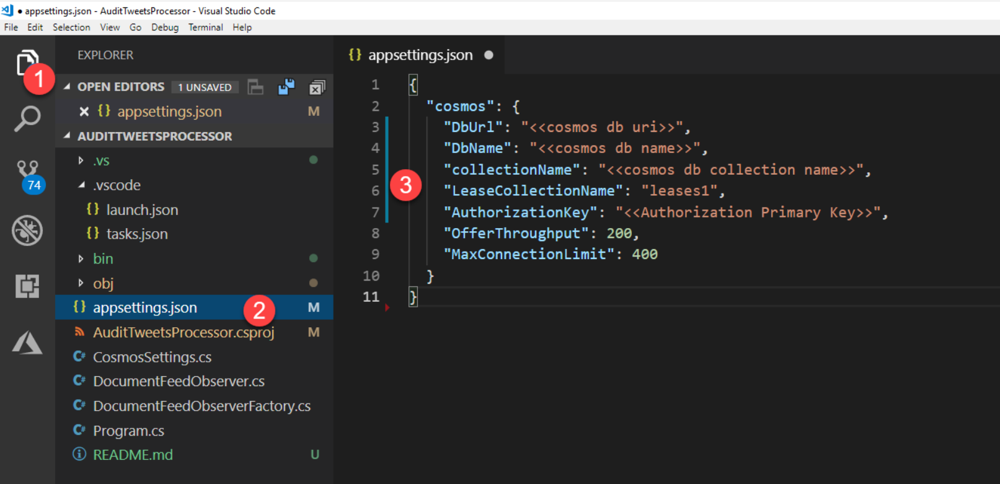

# Lab 3
## Change Feed Demo - Change Feed Processor Library

For this lab you will need to open the project from the QueryCosmos folder into VSCode.

-  Start VSCode. Click File | Open Folder (Ctrl + K, Ctrl + O), and select the folder `CosmosDBHandsonLab\lab\ChangeFeed\AuditTweetsProcessor` 
 

- Select the `appsettings.json` file to edit your configuration.