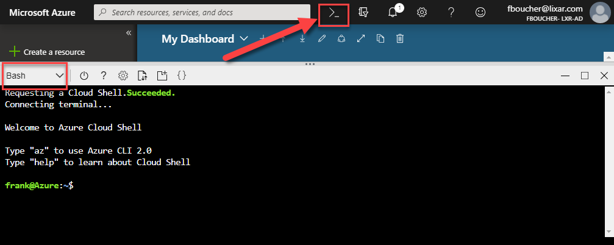
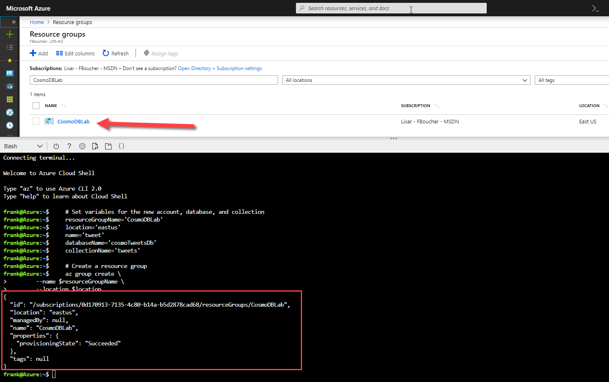
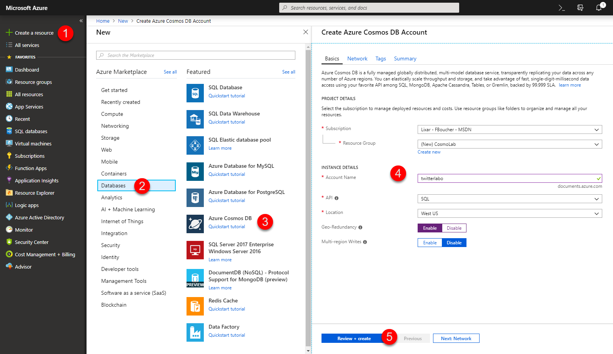
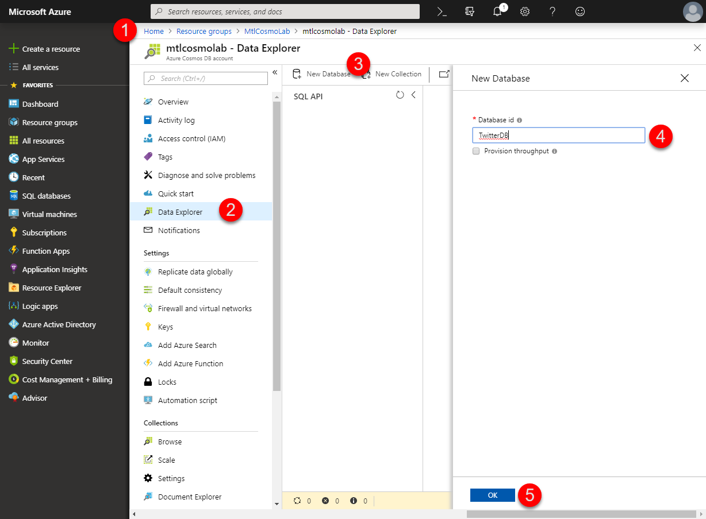
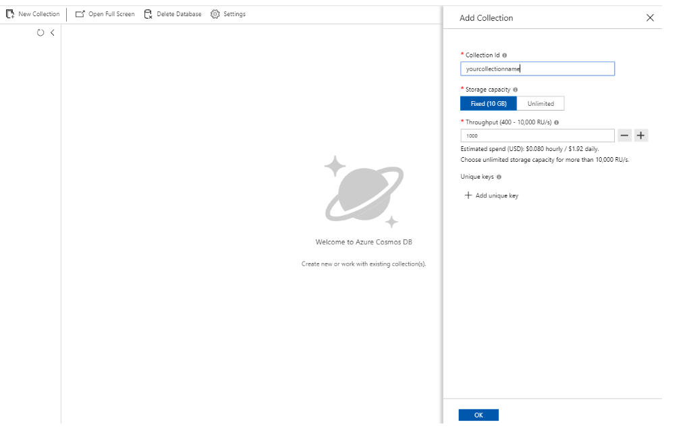

# Getting Started

In this lab, you will create an Azure Cosmos DB account, database, and multiple collections. You will then populate the collections with sample data that will be used in various labs.  There multiple ways to create Azure Cosmos DB Assets. In the next section decide if you prefer executing the Azure CLI script or using the user interface.

## Option 1: Create Azure Cosmos DB Assets by script

*You will now create an Azure Cosmos DB account to use in the remaining labs.*

1. In a Internet browser navigate to the **Azure Portal** (<http://portal.azure.com>), and sign in.

1. On the top of the screen, click on the `>_` button to open the Cloud Shell interface. If it's the first time note that it could take ~1 minutes.
   

1. In the folder *script*, from the root folder you will find the script [CosmosResourcesScript.bash](./scripts/CosmosResourcesScript.bash). Open it with VSCode, we will be editing it and copy-pasting piece of it in the Cloud Shell. 

1. Edit the variables at the beginning of the script.

```bash
# Set variables for the new account, database, and collection
resourceGroupName='CosmoDBLab'
location='eastus'
name='tweet'
databaseName='cosmoTweetsDb'
collectionName='tweets'
```

1. Now copy the two first snippets and paste it in cloud Shell. You should have a result similar to this. Note that the resource group as been created.
   

1. You need to continue copy-pasting all the section. doingint section by section will help you to see all the components.


## Option 2: Create Azure Cosmos DB Assets by the portal

> YOU ONLY NEED TO DO THIS SECTION IF YOU DID NOT RUN THE SCRIPT

*You will now create an Azure Cosmos DB account to use in the remaining labs.*

1. In a Internet browser navigate to the **Azure Portal** (<http://portal.azure.com>), and sign in.

1. On the top-left side of the portal, click the **Create a resource** button (big green "+").
	
    

1. In the new **Azure Cosmos DB** blade, perform the following actions:

    1. In the **ID** field, enter a globally unique value.

    1. In the **API** list, select the **SQL** option.

    1. Leave the **Subscription** field set to its default value.

    1. In the **Resource group** section, select the **Create new** option.

    1. In the **Resource group** section, enter the value **COSMOSLABS**  into the empty field.

    1. In the **Location** field, select the **West US** location.

    1. Ensure the **Enable geo-redundancy** option is selected.

        > This option creates a replicated version of your database in a second (paired) region.

    1. Ensure the **Enable Multi Master** option is not selected.

        > With Azure Cosmos DB multi-master support, you can perform writes on containers of data (for example, collections, graphs, tables) distributed anywhere in the world. You can update data in any region that is associated with your database account. These data updates can propagate asynchronously. 

    1. In the **Virtual networks** section, select the **Disabled** option.

        > Azure CosmosDB accounts can be configured to allow access only from specific subnet of an Azure Virtual Network. By enabling a Service Endpoint for Azure CosmosDB from a Virtual Network and its subnet, traffic is ensured an optimal and secure route to the Azure Cosmos DB.

    1. Click the **Review & Create** button.

1. Once the CosmoDB instance is created.

    

    1. Select the CosmoDB instance. Click on the Resource groups, then the Resource group you just created and finally the CosmoDB.

    1. From the CosmoDB blade, in the left panel, select the Data Explorer.

    1. At the top of this section click the button *New Database*.
    
    1. Type the name of the database (ex: TwitterDB).

    1. Click the blue *OK* button at the bottom of the page.
    

1. Next, Create New Collection by right clicking on the Database. In the new **Add Collection** blade, perform the following actions:

	

	1. In the **Databaase id** field, choose the recently created database.
	
	1. In the **Collection Id** field, enter the collection Name.
	
	1. Select the Fixed option for **Storage Capacity**
	
	1. In the **Throughput**, enter 1000 RU/sec
	
	1. Click OK.

1. Wait for the creation task to complete before completing this lab.
